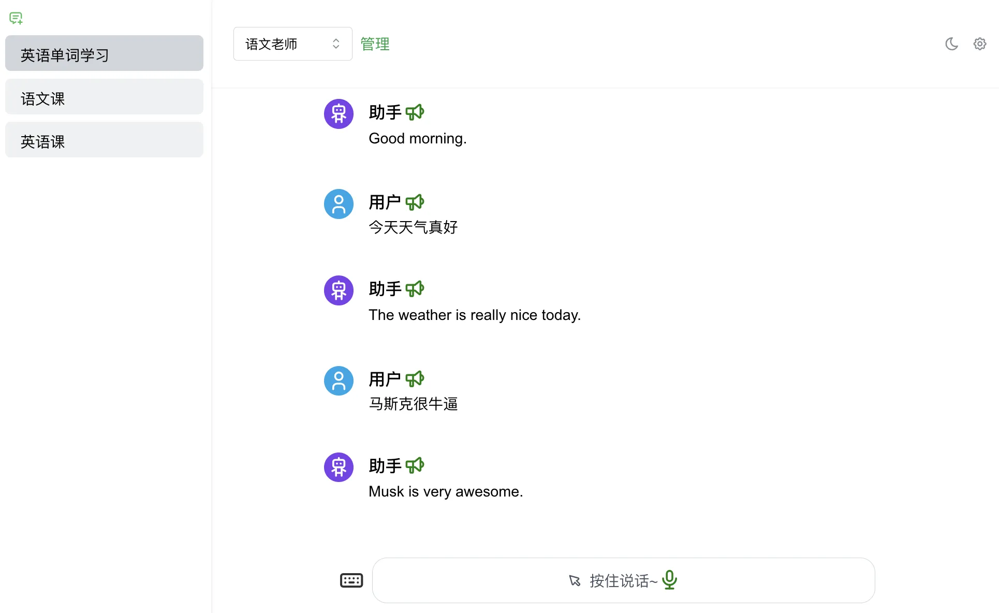

# 使用 ChatGPT 开发英语学习助手

[视频效果点这里](https://static.warmplace.cn/ai-teacher.mp4)

## 英语学习助手

通过这个项目帮你快速上手 ChatGPT 的前端开发

注意： 运行这个项目你需要配置 `API_KEY` 这个在 [platform.openai.com](https://platform.openai.com/api-keys) 配置，[参考官方文档](https://platform.openai.com/docs/quickstart)

## 项目功能

- [x] 项目参考 ChatGPT 的 UI 布局，分三个模块，助理管理、会话列表、消息列表，左右布局，左边是会话列表，右边是消息列表，
- [x] 助理管理其实是 OpenAI 官方的 接口配置，具体参数的含义请参考官网，这里不细说。通过配置不同的指令及其他参数实现不同的模式，如英语学习、语文学习等
- [x] 支持发送文字，支持打字效果、支持 markdown 渲染、支持停止回复
- [x] 支持语音功能，类似微信语音，使用 indexedDB 存储，可回放。注意：官方并不支持直接语音，需要通过文字转语音，语音再转文字的接口中转
- [x] 支持白天晚上主题模式切换

## 技术栈

- 项目使用`create-react-app`生成，命令： `npx create-react-app ai-teacher --template typescript`
- 样式集成了 `tailwindcss`，UI 集成了`@mantine/core`，封装了`indexedDB`存储数据，无后端服务。

- 代码规范方案： `editorConfig` + `prettier` + `eslint` + `commit`
- CI:
- CD: `Github Actions` + `docker-compose`

## 项目中使用了一些设计模式

- 单例模式： 语音播放、发送消息（对 fetch 的封装）
- 发布订阅模式： 使用 EventEmitter 用于一些非父子组件间的通信
- 门面模式：解决兼容性问题
- 流水线模式：关于业务逻辑的处理采用 pipeline 模式，逻辑清晰

## 指令

- You are an English teacher, No matter what I say, please answer in English
- You are a Chinese teacher, No matter what I say , you - should answer with chinese
- You are an English translator， No matter what I say, you should translate it with English
